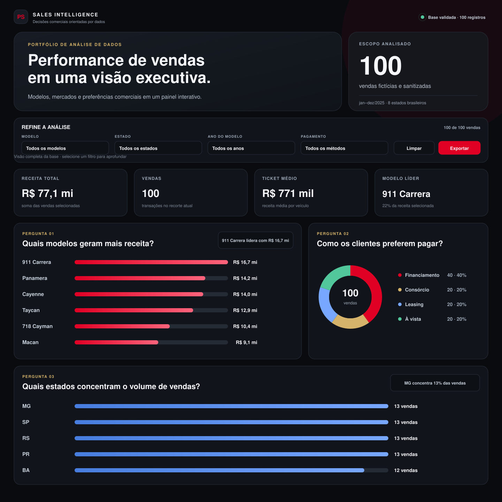
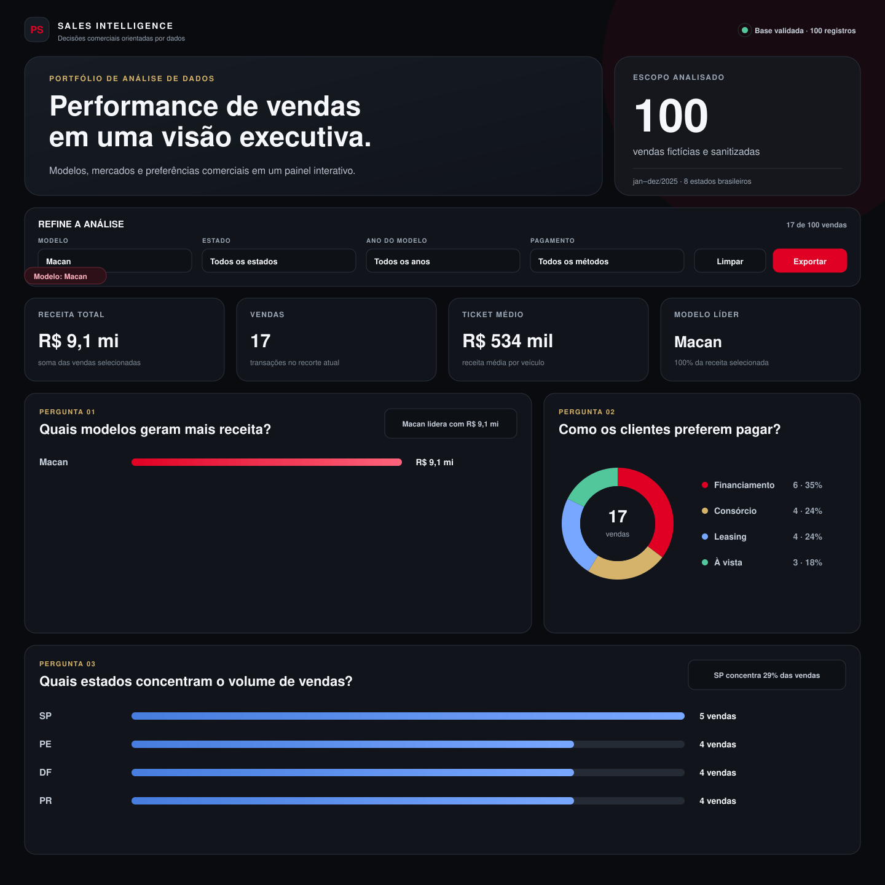

# Porsche Sales Intelligence

Dashboard web interativo para análise de uma base demonstrativa de vendas Porsche. O projeto transforma 100 registros sanitizados em uma experiência executiva, responsiva e pronta para publicação no GitHub Pages.

> Projeto educacional independente. A base utilizada é fictícia e não contém dados pessoais. Porsche é marca de seus respectivos titulares.

[](https://williamlopes-ai.github.io/dashboard-vendas-porsche/)

## Visão geral



O painel foi construído em um único arquivo `index.html`, sem frameworks, bibliotecas externas ou etapa de build. Ele funciona localmente, pode ser publicado diretamente no GitHub Pages e preserva a análise mesmo sem conexão com serviços de terceiros.

### Principais recursos

- quatro indicadores executivos: receita, volume de vendas, ticket médio e modelo líder;
- filtros por modelo, estado, ano do veículo e método de pagamento;
- três visualizações orientadas a perguntas de negócio;
- tabela para auditoria das transações do recorte atual;
- exportação dos dados filtrados em CSV;
- layout responsivo, navegação por teclado e suporte a redução de movimento;
- base demonstrativa reproduzível com exatamente 100 registros.

## Perguntas de negócio

### 1. Quais modelos geram mais receita?

Essa análise mostra quais linhas têm maior impacto financeiro. A decisão por um ranking em barras facilita a comparação direta do faturamento e ajuda a orientar campanhas, estoque e prioridade comercial.

### 2. Como os clientes preferem pagar?

A composição dos métodos de pagamento apoia decisões sobre crédito, campanhas e condições comerciais. O gráfico de rosca foi escolhido porque apresenta a participação de cada modalidade no total selecionado.

### 3. Quais estados concentram o volume de vendas?

O volume regional ajuda a identificar mercados relevantes e oportunidades de expansão. As barras horizontais preservam a leitura rápida das siglas e mostram a diferença entre os estados sem excesso de elementos visuais.

## Dashboard filtrado



Todos os indicadores, gráficos, insights e registros da tabela são recalculados quando um filtro é alterado. O contador no topo informa quantas vendas permanecem no recorte.

## Tratamento da base

A planilha original do curso não foi incluída no material recebido para esta entrega. Para manter o projeto executável e verificável, foi criada uma base **demonstrativa, fictícia e determinística** diretamente no JavaScript.

O tratamento representado no projeto segue estas regras:

1. remoção de qualquer campo que pudesse identificar clientes ou vendedores;
2. padronização de modelo, cidade, UF e método de pagamento;
3. conversão de ano e valor para tipos numéricos;
4. validação de datas e identificadores únicos;
5. conferência do total de 100 registros;
6. incorporação da base sanitizada ao HTML para evitar arquivos expostos ou dependências externas.

Como a geração é determinística, os mesmos registros são produzidos em todos os acessos. Não há uso de `Math.random()` nem de dados carregados pela internet.

## Como a IA foi utilizada

### Prompt-base

```text
Crie um dashboard executivo de vendas automotivas em um único arquivo HTML, usando apenas HTML, CSS e JavaScript nativos. Trabalhe com uma base sanitizada de 100 vendas e responda a três perguntas de negócio: quais modelos geram mais receita, quais estados concentram mais vendas e quais formas de pagamento são mais utilizadas. Inclua receita total, volume de vendas, ticket médio, modelo líder, filtros interativos, tabela auditável e exportação CSV. O resultado deve ser responsivo, acessível, funcionar offline e estar pronto para o GitHub Pages.
```

### Decisões tomadas após a primeira proposta

- a paleta foi reduzida a tons escuros, vermelho, dourado e azul para criar hierarquia sem poluição visual;
- dependências externas foram removidas para tornar o arquivo portátil e rápido;
- os dados passaram a ser gerados de forma determinística e auditável;
- os filtros foram concentrados em uma única faixa e receberam indicação do recorte ativo;
- cada gráfico ganhou uma pergunta explícita e um insight textual;
- a tabela detalhada e a exportação CSV foram adicionadas para aproximar a experiência de um produto real;
- o layout recebeu ajustes específicos para desktop, tablet e celular.

O papel da IA foi acelerar a estrutura inicial. A seleção das perguntas, a hierarquia do conteúdo, a revisão dos indicadores, as regras de sanitização e o acabamento visual fizeram parte das decisões do projeto.

## Estrutura do repositório

```text
dashboard-vendas-porsche/
├── images/
│   ├── dashboard.png
│   └── filtros-aplicados.png
├── .gitignore
├── README.md
└── index.html
```

## Executar localmente

Não é necessário instalar dependências.

1. Baixe ou clone o repositório.
2. Abra `index.html` no navegador.

Para simular o mesmo ambiente do GitHub Pages, também é possível iniciar um servidor local:

```bash
python3 -m http.server 8000
```

Depois, acesse `http://localhost:8000`.

## Publicação no GitHub Pages

1. Abra **Settings → Pages** no repositório.
2. Em **Build and deployment**, selecione **Deploy from a branch**.
3. Escolha a branch `main` e a pasta `/ (root)`.
4. Salve e aguarde a publicação.

Endereço esperado:

```text
https://williamlopes-ai.github.io/dashboard-vendas-porsche/
```

## Tecnologias

- HTML5 semântico;
- CSS moderno com Grid, Flexbox e `conic-gradient`;
- JavaScript ES2022;
- GitHub Pages.

## Privacidade e escopo

- nenhuma informação pessoal é armazenada;
- nenhuma requisição externa é realizada;
- a base é fictícia e serve apenas para demonstração técnica;
- o projeto não representa nem possui vínculo oficial com a Porsche.

## Autor

Desenvolvido por [William Lopes](https://github.com/williamlopes-ai) como projeto de portfólio em análise de dados.
